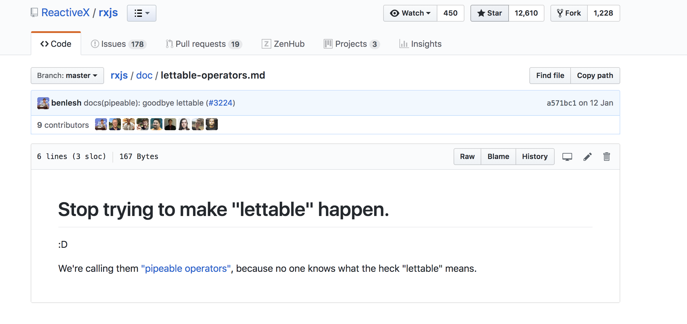

@title[let]

## Let's me introduce you to  the __let__ operator

__let me have the whole observable.__

It takes a function that takes an observable and returns an observable. 

```
const filterUndefined = (sourceObservable) => 
  new Observable((observable) => {
    return sourceObservable.subscribe({
      next(value) {
        if (!_.isUndefined(value)) {
          observable.next(fn(value)) 
        }
      },
      error(err) { observable.error(err) }
    })

sourceStream
  .let(filterUndefined)
  .subscribe((value) => console.log(value)))

```

---

@title[let_example]

## Another example, a custom version of map.

```
const myMap => (fn) => (sourceObservable) => 
  new Observable((observable) => {
    return sourceObservable.subscribe({
      next(value) { observable.next(fn(value)) },
      error(err) { observable.error(err) }
    })

sourceStream
  .filter((value) => value > 10))
  .let(myMap((value) => value + 1))
  .subscribe((value) => console.log(value)))

```

---

@title[let_recap]

## Recap

* It's a functional way to use operators through high order functions.
* **It allows you to extend functionality without having to extend the Observable class**.

---

@title[thinking]

## ... without having to extend the Observable class


---

@title[we_are_patching]

We are patching the Observable class.

```
import 'rxjs/add/operators/map';
import 'rxjs/add/operators/filter';

sourceStream
  .filter((value) => value > 10))
  .map(value) => value + 1)
  .subscribe((value) => console.log(value)))
```

---

@title[it_was_bad]

## And that is bad because:

* It looks weird.
* Operators patched directly onto the prototype are not "tree-shakeable".
* Those lines could be in any file in the projects and the code would still work.
  * Unused operators that are being imported in apps cannot be detected reliably.
* Any library that imports a patch operator will augment the Observable.prototype for all consumers of that library, creating blind dependencies. If the library removes their usage, they unknowingly break everyone else. With pipeables, you have to import the operators you need into each file you use them in.
  
 ---

@title[lettable_operators]

## That's why we have lettable operators that are pure functions

```
import { map } from 'rxjs/operators/map';
import { filter } from 'rxjs/operators/filter';

sourceStream
  .let(filter((value) => value > 10)))
  .let(map(value) => value + 1))
  .subscribe((value) => console.log(value)))
```

---

@title[lettable_operators_bad_parts]

## It was a bit too verbose, so we can maybe offer a better way of doing composition

```
import { map, filter } from 'rxjs/operators/map';

sourceStream.pipe(
  filter((value) => value > 10)),
  map(value) => value + 1))
).subscribe((value) => console.log(value)))
```

---

@title[lettable_not_happening]



---
@title[pipeall]


@title[nicer_import]

# Also, we can use them like this.

*with some changes in the webpack config*

```
import { map, filter } from 'rxjs/operators/map';
```
---

@title[easy_to_reuse]

## Easy to reuse

```
import { map, filter } from 'rxjs/operators/filter';

const filterUndefined = filter(_.negate(_.isUndefined))

sourceStream.pipe(
  filterUndefined,
  map(value) => value + 1))
).subscribe((value) => console.log(value)))
```


